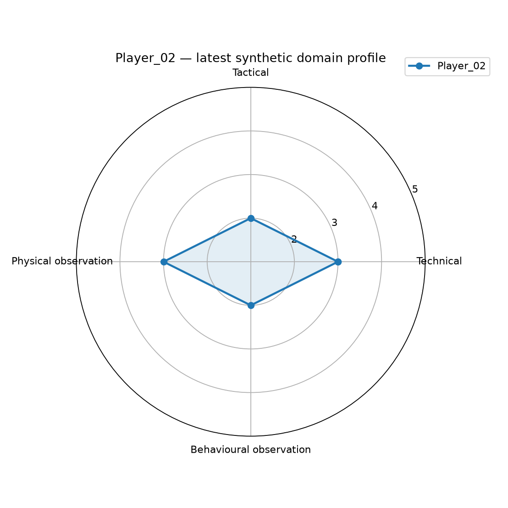
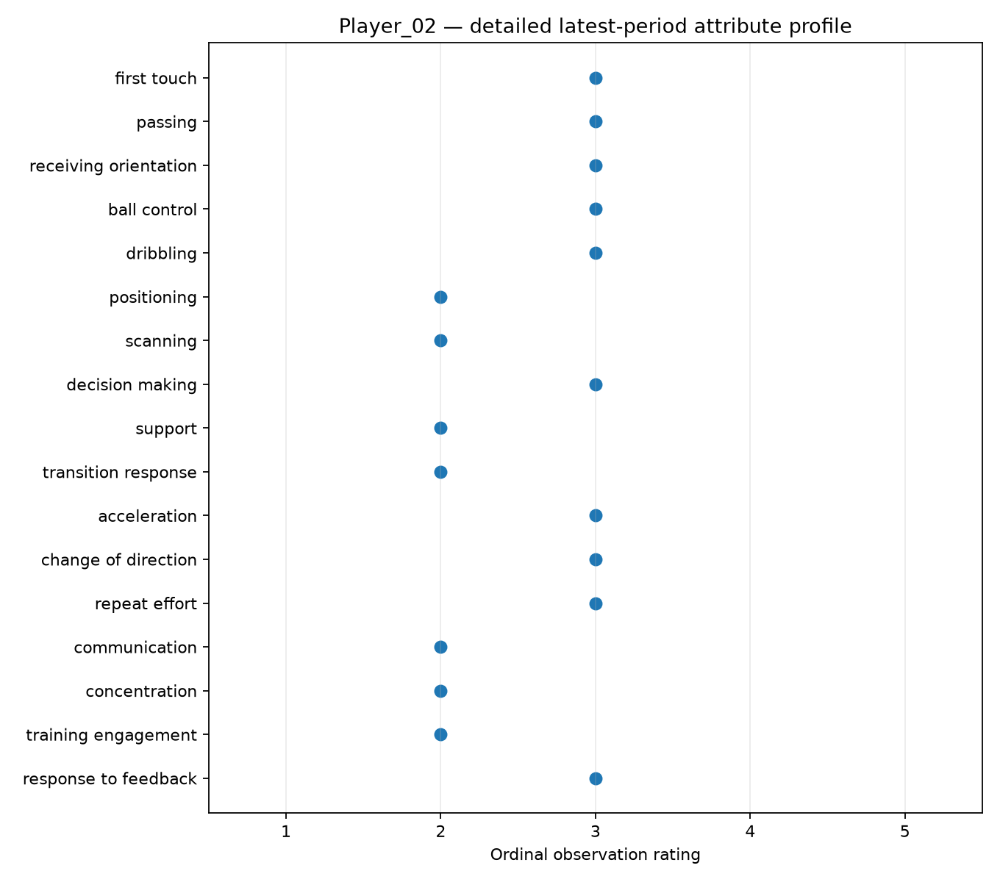
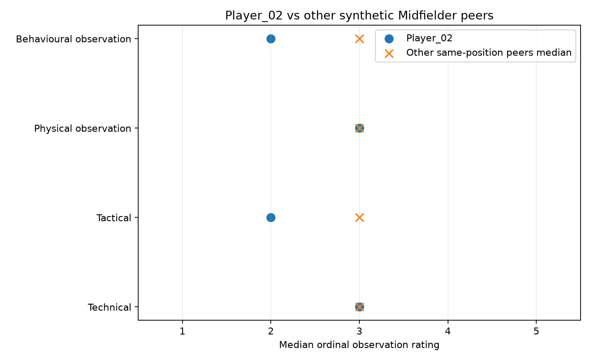
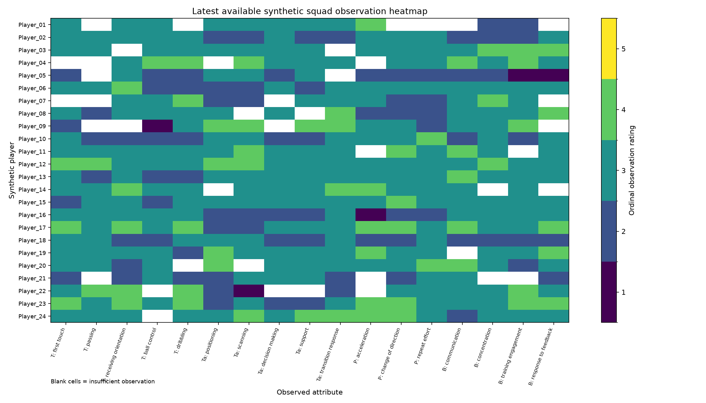
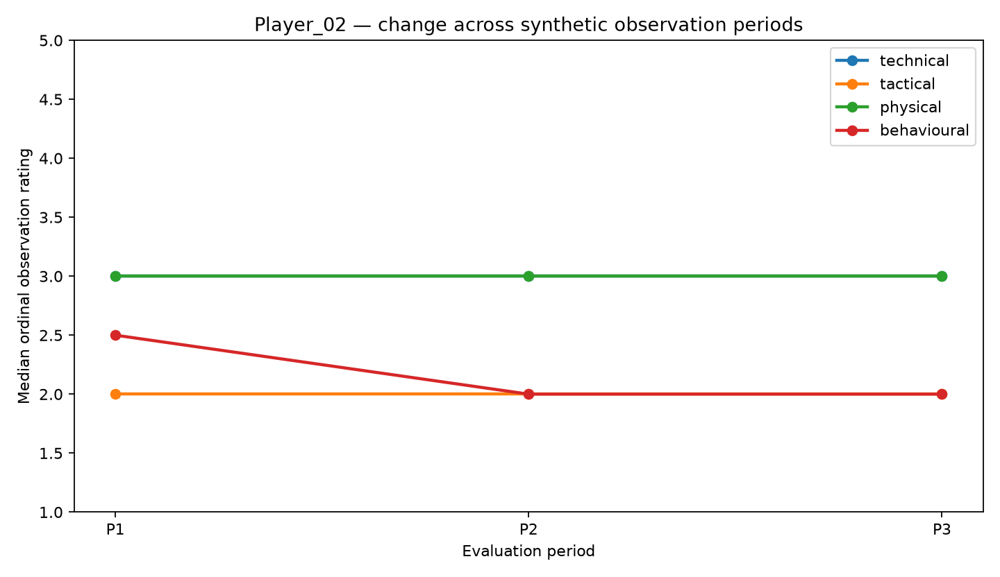
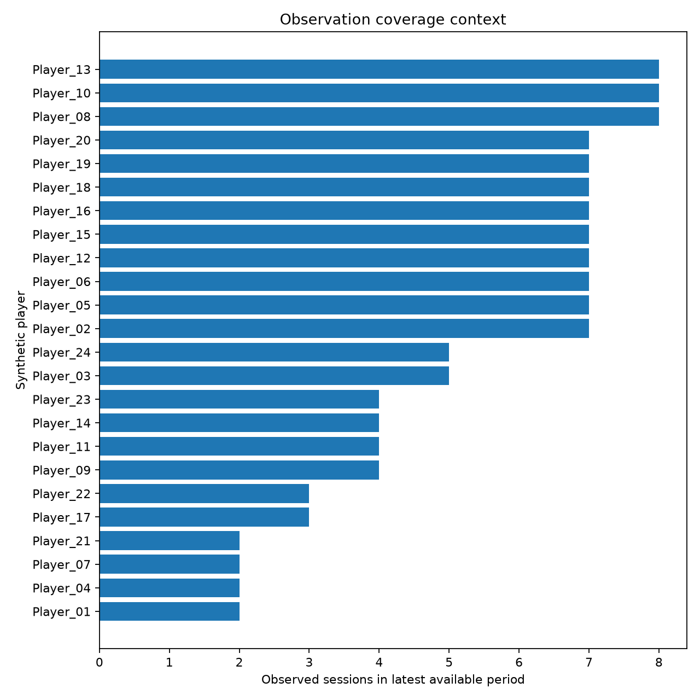

# Project 03 — Youth Football Player Performance Profiling

Privacy-safe Python workflow for structuring and visualising synthetic coach observations in youth football.


## Core workflow

`Structured observations → behavioural anchors → validation → coverage checks → ordinal profiles → leave-one-out peer comparison → visual outputs`

## What V0.2 demonstrates

- explicit definitions and behavioural anchors for 17 observed attributes;
- `NA = insufficient observation`, never a low-performance score;
- observation-session and attribute coverage;
- acceptance of missing evaluation periods;
- acceptance of position changes across periods;
- peer medians that exclude the focal player and match the same evaluation period and current position group;
- no programmed positional ability advantages;
- no forced team-wide improvement over time;
- no overall player score, talent score, ranking or selection probability;
- compact four-domain radar plus detailed attribute visualisation;
- a discrete 1–5 squad heatmap.

## Observation domains

- **Technical**
- **Tactical**
- **Physical observations**
- **Behavioural observations**

The framework structures observable football behaviours. It does not claim to provide a clinical or psychological assessment.

## Rating scale

1 = rarely demonstrated effectively  
2 = occasionally demonstrated effectively  
3 = regularly demonstrated effectively  
4 = frequently demonstrated effectively  
5 = consistently demonstrated effectively  
NA = insufficient observation

The scale is ordinal; medians are used as the primary aggregation statistic.

## Synthetic demo

The public demo uses 24 fictitious player IDs, three possible evaluation periods, broad outfield position groups, Training / Match / Mixed observation contexts, 2–8 observed sessions per player-period, and deliberately incomplete observations.

All player-level records are fully synthetic. No public row is an anonymised copy of a real youth player.

## Main outputs

### Four-domain player profile



### Detailed attribute profile



### Player vs matched peer group



### Squad observation heatmap



### Change across observation periods



### Observation coverage



## Methodological safeguards

- missing observations remain missing rather than becoming zero;
- domain medians require at least 50% attribute coverage;
- the focal player is excluded from their own peer reference;
- peer references use the same evaluation period and current position group;
- position changes and incomplete longitudinal records are valid;
- synthetic data do not encode position stereotypes or a forced improvement trend;
- the project produces no automated player ranking or selection recommendation.

## Repository structure

```text
.
├── README.md
├── requirements.txt
├── .gitignore
├── .github/
│   └── workflows/
│       └── tests.yml
├── python/
│   ├── __init__.py
│   ├── generate_synthetic_profiles.py
│   └── player_profiling_analysis.py
├── data/
│   ├── README.md
│   ├── synthetic_player_profiles.csv
│   └── reference/
│       └── observation_framework.csv
├── docs/
│   └── profiling_methodology.md
├── tests/
│   ├── conftest.py
│   └── test_player_profiling.py
└── outputs/
    ├── player_domain_radar.png
    ├── player_attribute_profile.png
    ├── player_vs_peer_group.png
    ├── squad_profile_heatmap.png
    ├── player_change_over_time.png
    ├── observation_coverage.png
    ├── player_profile_summary.csv
    └── validated_profiles.csv
```

## Run locally

```bash
pip install -r requirements.txt
python python/generate_synthetic_profiles.py
python python/player_profiling_analysis.py
pytest
```

## Tests

The current V0.2 suite contains 29 tests covering reproducibility, validation, missing observations, observation coverage, ordinal-domain aggregation, missing periods, position changes, privacy-oriented schema checks and same-period/same-position leave-one-out peer references.

## Scope and limitations

This project is descriptive and development-oriented. It is not an automated selection, talent-identification, recruitment, medical or psychological system. Coach observations remain context-dependent and subjective; the public synthetic demo does not provide inter-rater reliability estimates or claim to be a validated measurement instrument.

See [`docs/profiling_methodology.md`](docs/profiling_methodology.md) for the detailed methodology.

## Project context

This repository is a public portfolio reconstruction of a structured player-observation workflow developed during a youth-football internship. The public version prioritises privacy, reproducibility, auditability and conservative interpretation.


Generated synthetic data and visual outputs are rebuilt by the repository workflow after source changes.
